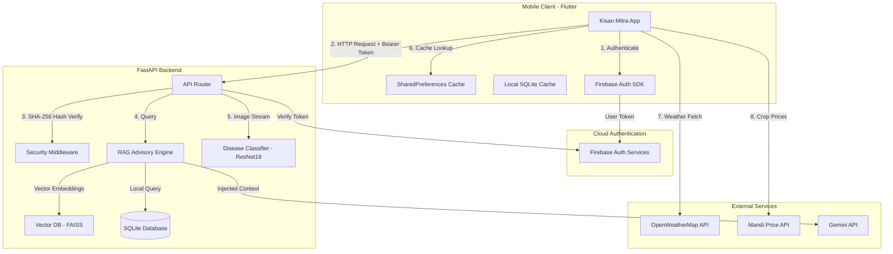

# 🌾 Kisan Mitra (Farmer's Friend)

<div align="center">
  
  
  
  
  
</div>

<br>

**Kisan Mitra** is an intelligent, secure, context-aware mobile decision-support system designed to empower smallholder farmers. It delivers localized precision agricultural advice, real-time weather alerts, regional market prices, and image-based leaf disease classifications directly to farmers' mobile devices. 

By bridging the gap between agronomic sciences and traditional farming, Kisan Mitra optimizes crop yields, reduces input costs, and identifies pathogens in real time.

---

## ✨ Key Features

* 🤖 **Context-Aware AI Advisor**: 
  * Powered by **Gemini-2.5-Flash** and a custom **Retrieval-Augmented Generation (RAG)** pipeline.
  * Injects real-time farm profiles (soil type, crop history, farm area) and local weather metrics into prompts to generate highly targeted advice.
* 🍂 **Leaf Disease Detection (Production V2)**:
  * Diagnoses leaf diseases across **20 crop/disease classes** using a fine-tuned **ResNet18** CNN.
  * Model trained with MixUp, CutMix, Random Erasing augmentations, and oversampled mined hard negatives, achieving **69.89% field accuracy** and reducing healthy false alarms by **78.9%**.
* 🌦️ **7-Day Weather Forecast & Caching**:
  * Fetch current weather and forecast concurrently.
  * Aggregates 5-day / 3-hour OpenWeatherMap forecasts into 7 daily summaries.
  * Implements **coordinate-precision caching (~5km)** in SharedPreferences with automatic **offline fallback** support.
* 📊 **Mandi Market Prices**:
  * Real-time search of regional crop rates sourced directly from the Government of India APMC database (`data.gov.in`).
* 🔒 **Hardened Security**:
  * JWT verification on all backend API routes using Google Firebase token verification.
  * Computed SHA-256 signature verification of Python Pickle binaries before deserialization (CWE-502).

---

## 🏛️ System Architecture



---

## 🛠️ Technology Stack

* **Frontend**: Flutter, Dart, Provider (State Management), GoRouter (Declarative Routing), SQLite (`sqflite`), SharedPreferences.
* **Backend**: Python, FastAPI, Uvicorn, PyTorch, FAISS (Vector database), Firebase Admin SDK.
* **Cloud Services**: Firebase Auth, Google Gemini API, OpenWeatherMap 2.5 API, Gov Mandi API.

---

## 🚀 Installation & Setup

### Prerequisites
* [Flutter SDK](https://docs.flutter.dev/get-started/install) (latest stable version)
* [Python 3.10+](https://www.python.org/downloads/)
* A Firebase Project (Auth enabled)

### A. Backend Setup
1. **Navigate to the backend directory**:
   ```bash
   cd backend
   ```
2. **Install Python dependencies**:
   ```bash
   pip install -r requirements.txt
   ```
3. **Initialize the SQLite database**:
   ```bash
   python setup_database.py
   ```
4. **Start the FastAPI backend server**:
   ```bash
   uvicorn main:app --host 0.0.0.0 --port 8000 --reload
   ```

### B. Frontend Setup
1. **Navigate to the root directory**:
   ```bash
   cd ..
   ```
2. **Install Flutter packages**:
   ```bash
   flutter pub get
   ```
3. **Inject API Keys at Compile Time**:
   Configure keys using compile-time constants:
   ```bash
   flutter run --dart-define=OPENWEATHER_API_KEY=your_key --dart-define=GEMINI_API_KEY=your_key --dart-define=MANDI_API_KEY=your_key
   ```

---

## 📷 App Screenshots Placeholders
* **Home Dashboard**: `[Insert Home Screen Screenshot here]`
* **7-Day Weather**: `[Insert Expandable Weather Cards Screenshot here]`
* **AI Advisor Chat**: `[Insert Context-Aware Chatbot Screen here]`
* **Disease Diagnosis**: `[Insert Crop Disease Result Screen here]`

---

## 🛡️ Security Configuration

* **Backend Token Verification**: Handled inside `main.py` using `Depends(verify_token)`. No requests are accepted without a valid Firebase Bearer token header.
* **Safe Deserialization**: Preprocessors are validated against SHA-256 signatures in `security_utils.py` before loading to prevent malicious payload executions.
* **Sensitive Files**: `.env*` files must never be committed. Whitelists are configured inside `.gitignore`.

---

<div align="center">
  <i>Empowering Smallholder Farmers with Precision Agritech ❤️</i>
</div>
