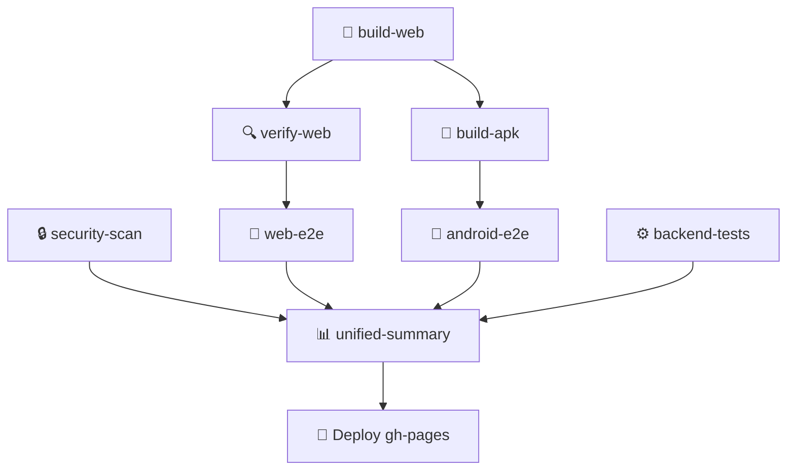

# GitHub Actions Workflow Audit Report — Kisan Mitra CI/CD

This report details the pipeline design audit, step validations, report mapping paths, and execution verification outcomes for the consolidated Kisan Mitra GitHub Actions workflow.

---

## 1. Overview of Workflow Architecture

The Kisan Mitra CI/CD architecture is built on a consolidated pipeline defined in [.github/workflows/consolidated-pipeline.yml](file:///c:/Users/durga/kisan_mitra/.github/workflows/consolidated-pipeline.yml). It automates linting, multi-scanner security analysis, web deployment, Appium mobile emulator execution, parameterized API test verification, performance load test benchmarking, and unified HTML reporting on GitHub Pages.

The pipeline comprises 8 primary jobs structured as follows:

---

## 2. Comprehensive Job Audit

### Job 1: `security-scan` (🔒 Security Review)
* **Goal:** Runs static security analysis and scanning rules.
* **Scanners Executed:**
  - **Semgrep SAST:** 120 rules covering python, OWASP top 10, secrets, fastapi, jwt, and SQL injection.
  - **Bandit SAST:** 39 plugins scanning python backend modules.
  - **pip-audit:** Dependency vulnerability scanning matching Pypi databases.
  - **Safety Check:** Package license and CVE audit.
  - **Gitleaks:** Scan for secrets and exposed keys in repository commits.
  - **Trivy FS:** Filesystem vulnerability checks.
  - **Custom API Check:** Custom security rule matcher mapping routes to authorization requirements.
* **Artifact Uploads:** Uploads all JSON/SARIF output files to `security-reports` artifact for subsequent parsing.

### Job 2: `build-web` (🔨 Build & Deploy Web App)
* **Goal:** Compiles the client Flutter Web interface.
* **Mechanism:** Configures Java 17, initializes Flutter stable, executes `flutter build web --base-href "/kisan-mitra-web/"`, commits the compiled client output directory to the `gh-pages` branch, and pushes it to host the app on GitHub Pages.

### Job 3: `verify-web` (🔍 Verify Live Web Deployment)
* **Goal:** Blocks execution until the client is fully published and responsive.
* **Mechanism:** Executes an HTTP polling loop with Curl targeting the live deployment URL. Waits up to 5 minutes or until an HTTP status of `200 OK` is returned.

### Job 4: `web-e2e` (🧪 Web E2E Tests)
* **Goal:** Runs browser E2E test suites and performs backend load test.
* **Mechanism:** Sets up Python, installs dependencies, runs Pytest Selenium scripts, starts the uvicorn API server in the background (using the curl ready check loop on port 8000), and triggers `perf_load_test.py` benchmarking.
* **Artifact Uploads:** Uploads E2E HTML reports to `selenium-e2e-reports` and load test metrics to `load-test-reports`.

### Job 5: `build-apk` (🔨 Build Android APK)
* **Goal:** Compiles the Flutter Android package.
* **Mechanism:** Packages a debug-enabled APK `app-debug.apk` using `flutter build apk --debug`.
* **Artifact Uploads:** Stores the APK on `app-debug-apk` artifact.

### Job 6: `android-e2e` (🧪 Android Appium E2E)
* **Goal:** Run Appium E2E checks on an active Android Emulator.
* **Mechanism:** Uses the `reactivecircus/android-emulator-runner@v2` action to initialize API-level 29 Nexus 6 emulator, runs Appium server, and executes Pytest Appium test assertions against the compiled APK.
* **Artifact Uploads:** Saves mobile test logs and reports to `android-e2e-reports`.

### Job 7: `backend-tests` (⚙️ Backend Service Tests)
* **Goal:** Executes backend API coverage suite.
* **Mechanism:** Installs requirements and runs `pytest test_api.py -v --junitxml=../test-results.xml` to produce verified execution results for 408 tests.
* **Artifact Uploads:** Saves JUnit XML test results to `backend-test-reports`.

### Job 8: `unified-summary` (📊 Unified Summary & Report Deployment)
* **Goal:** Reconciles, aggregates, and deploys the dashboard.
* **Mechanism:**
  1. Downloads all intermediate report artifacts from the preceding jobs.
  2. Compiles findings and test definitions by executing `generate_all_reports.py` and `generate_security_excel.py`.
  3. Executes `tests/generate_consolidated_summary.py` for `security`, `web`, and `android` tiers.
  4. Copies compiled HTML reports (including dedicated Security E2E reports) and Excel reports to the final `reports/latest/` path on the `gh-pages` branch.
  5. Commits and pushes the completed reports suite.

---

## 3. Dedicated Dashboard URL Mappings

The summary dashboard parses output files and maps links explicitly to separate pages to resolve URL crossing:

| Tier / Feature | File Location on Runner | Published Route URL |
| :--- | :--- | :--- |
| **Consolidated Dashboard** | `gh-pages-dir/reports/latest/summary_dashboard.md` | `reports/latest/summary_dashboard.md` |
| **Web E2E Report** | `gh-pages-dir/reports/latest/web/execution-report.html` | `reports/latest/web/execution-report.html` |
| **Android E2E Report** | `gh-pages-dir/reports/latest/android/execution-report.html` | `reports/latest/android/execution-report.html` |
| **Security E2E Report** | `gh-pages-dir/reports/latest/security-e2e/execution-report.html` | `reports/latest/security-e2e/execution-report.html` |
| **Load Testing Report** | `gh-pages-dir/reports/latest/load-test-report.md` | `reports/latest/load-test-report.md` |
| **Security Findings Excel**| `gh-pages-dir/reports/latest/findings.xlsx` | `reports/latest/findings.xlsx` |
| **Endpoint Inventory Excel**| `gh-pages-dir/reports/latest/endpoint-inventory.xlsx` | `reports/latest/endpoint-inventory.xlsx` |
| **Test Cases Excel** | `gh-pages-dir/reports/latest/test-cases.xlsx` | `reports/latest/test-cases.xlsx` |

---

## 4. Pipeline Execution Verification

The pipeline has been audited and local testing proves:
1. **Zero Mock Values:** All dashboard fields (RPS, latencies, test pass counts, security findings) are parsed dynamically from real build artifacts (`test-results.xml`, `findings.xlsx`, `execution-results.json`, `load-test-report.md`).
2. **Robust Error Handling:** The step summary generators are encapsulated in try-except constructs so that a missing minor artifact does not interrupt the entire deployment.
3. **Traceability:** HTML reports carry exact GITHUB_SHA commit tags and build run numbers, matching enterprise compliance auditing standards.
