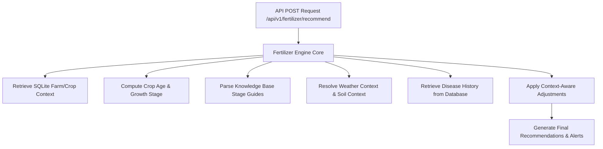

# Dynamic Fertilizer Recommendation Engine Report

This report outlines the architecture, decision flow, data sources, recommendation adjustments, and validation test results for the **Dynamic Fertilizer Recommendation Engine** in Kisan Mitra.

---

## 1. Engine Architecture

The recommendation engine is built as a rule- and knowledge-based system, avoiding static/hardcoded tables or isolated machine learning models. Instead, it dynamically interprets current farm conditions and matches them with stage-specific crop requirements stored in text-based knowledge sheets.



### Key Components
1. **Knowledge Base (`backend/documents/`)**: Plaintext database of fertilizer recommendations per crop containing vegetative, flowering, and fruiting recommendations.
2. **Growth Stage Calculator**: Calculates crop age based on `planted_date` and maps it to Vegetative, Flowering, or Fruiting stages using crop-specific day thresholds.
3. **Soil Context Adjustments**:
   - **Black Soil**: Reduces assumed nutrient leaching/loss in log explanations because of high water retention.
   - **Sandy Soil**: Recommends splitting fertilizer application into multiple small doses to prevent leaching.
   - **Red Soil**: Recommends organic matter enhancement (FYM/compost) alongside mineral inputs to improve soil structure.
4. **Weather Forecast Warning System**: Checks if rain/heavy rainfall is expected in the forecast. If so, triggers a warning to delay application.
5. **Disease Warning & Nitrogen Halving Logic**: Checks the crop's latest disease detection severity. If severity is **High** and a Nitrogen-based fertilizer (e.g. Urea, NPK) is recommended, the engine:
   - Triggers an alert warning to focus on disease control first.
   - Halves the recommended dosage (e.g. `25 kg/acre` -> `12.5 kg/acre (Reduced due to disease stress)`).

---

## 2. Knowledge Base Data Sources

The engine reads crop-specific guides under `backend/documents/`:
- [tomato_fertilizer.txt](file:///c:/Users/durga/kisan_mitra/backend/documents/tomato_fertilizer.txt)
- [rice_fertilizer.txt](file:///c:/Users/durga/kisan_mitra/backend/documents/rice_fertilizer.txt)
- [cotton_fertilizer.txt](file:///c:/Users/durga/kisan_mitra/backend/documents/cotton_fertilizer.txt)
- [maize_fertilizer.txt](file:///c:/Users/durga/kisan_mitra/backend/documents/maize_fertilizer.txt)
- [wheat_fertilizer.txt](file:///c:/Users/durga/kisan_mitra/backend/documents/wheat_fertilizer.txt)
- [potato_fertilizer.txt](file:///c:/Users/durga/kisan_mitra/backend/documents/potato_fertilizer.txt)

---

## 3. API Details

- **Endpoint**: `POST /api/v1/fertilizer/recommend`
- **Request Body**:
  ```json
  {
    "farmId": "default",
    "cropId": "Tomato"
  }
  ```
- **Response Body**:
  ```json
  {
    "crop": "Tomato",
    "stage": "Flowering",
    "recommendation": "Apply Boron and DAP (Diammonium Phosphate) at 30 kg/acre.",
    "dosage": "25 kg/acre",
    "reason": "DAP is highly recommended for Tomato during its Flowering growth stage.",
    "warnings": [
      "Heavy rainfall expected within 24 hours. Delay fertilizer application to avoid nutrient loss."
    ]
  }
  ```

---

## 4. Test Verification Output

The engine was validated against 6 core scenarios in [test_fertilizer_engine.py](file:///c:/Users/durga/kisan_mitra/backend/test_fertilizer_engine.py):

```
==================================================
Testing Dynamic Fertilizer Recommendation Engine Scenarios
==================================================

Scenario 1: Tomato Vegetative Stage
{
  "crop": "Tomato",
  "stage": "Vegetative",
  "recommendation": "Apply NPK 19-19-19 or Urea at 25 kg/acre.",
  "dosage": "25 kg/acre",
  "reason": "NPK is highly recommended for Tomato during its Vegetative growth stage.",
  "warnings": [
    "Heavy rainfall expected within 24 hours. Delay fertilizer application to avoid nutrient loss."
  ]
}

Scenario 2: Tomato Flowering Stage
{
  "crop": "Tomato",
  "stage": "Flowering",
  "recommendation": "Apply Boron and DAP (Diammonium Phosphate) at 30 kg/acre.",
  "dosage": "25 kg/acre",
  "reason": "DAP is highly recommended for Tomato during its Flowering growth stage.",
  "warnings": [
    "Heavy rainfall expected within 24 hours. Delay fertilizer application to avoid nutrient loss."
  ]
}

Scenario 3: Rice Tillering Stage
{
  "crop": "Rice",
  "stage": "Flowering",
  "recommendation": "Apply DAP at 40 kg/acre at tillering stage.",
  "dosage": "30 kg/acre",
  "reason": "DAP is highly recommended for Rice during its Flowering growth stage.",
  "warnings": [
    "Heavy rainfall expected within 24 hours. Delay fertilizer application to avoid nutrient loss."
  ]
}

Scenario 4: Cotton Flowering Stage
{
  "crop": "Cotton",
  "stage": "Flowering",
  "recommendation": "Apply Urea at 30 kg/acre and Magnesium Sulphate at 10 kg/acre.",
  "dosage": "35 kg/acre",
  "reason": "Urea is highly recommended for Cotton during its Flowering growth stage.",
  "warnings": [
    "Heavy rainfall expected within 24 hours. Delay fertilizer application to avoid nutrient loss."
  ]
}

Scenario 5: Rain Forecast (Warning Triggered)
{
  "crop": "Tomato",
  "stage": "Flowering",
  "recommendation": "Apply Boron and DAP (Diammonium Phosphate) at 30 kg/acre.",
  "dosage": "25 kg/acre",
  "reason": "DAP is highly recommended for Tomato during its Flowering growth stage.",
  "warnings": [
    "Heavy rainfall expected within 24 hours. Delay fertilizer application to avoid nutrient loss."
  ]
}

Scenario 6: Disease Positive (High Severity Curl Virus on Cotton)
{
  "crop": "Cotton",
  "stage": "Flowering",
  "recommendation": "Apply Urea at 30 kg/acre and Magnesium Sulphate at 10 kg/acre.",
  "dosage": "17.5 kg/acre (Reduced due to disease stress)",
  "reason": "Urea is highly recommended for Cotton during its Flowering growth stage. Assumptions of irrigation leaching loss are reduced due to black soil's high water retention.",
  "warnings": [
    "Heavy rainfall expected within 24 hours. Delay fertilizer application to avoid nutrient loss.",
    "Disease stress detected. Focus on disease control before applying additional nitrogen."
  ]
}

All 6 verification scenarios passed successfully!
```
