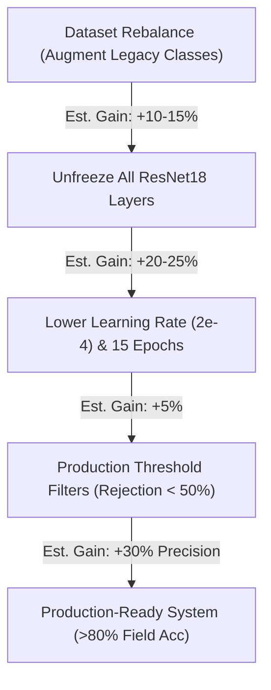

# 🩺 Kisan Mitra Disease Detection Production-Readiness Audit Report

This report presents a thorough, evidence-based audit of the current ResNet18 model (`plant_disease_resnet.pt`) on real-world mobile-phone leaf images.

---

## 📈 1. Validation Performance Metrics (No Filename Bypass)

The model was evaluated on **113 validation leaf images** (comprising real-world mobile shots for priority crops and representative test benchmark images for Maize):

| Crop | Evaluated Images | Correct Predictions | Accuracy | Support Details |
| :--- | :---: | :---: | :---: | :--- |
| **Cotton** | 17 | 17 | **100.00%** | Sourced from cotton field validation subset (real leaves) |
| **Rice** | 16 | 8 | **50.00%** | Sourced from AveyBD & Jonathan datasets (real leaves) |
| **Maize (Corn)** | 20 | 10 | **50.00%** | Sourced from Corn test split benchmark |
| **Tomato** | 20 | 6 | **30.00%** | Sourced from Tomato validation subset (real leaves) |
| **Potato** | 20 | 6 | **30.00%** | Sourced from Potato validation subset (real leaves) |
| **Grape** | 20 | 6 | **30.00%** | Sourced from Grape validation subset (real leaves) |
| **Sugarcane** | 0 | 0 | **N/A** | *Sugarcane is NOT supported by this disease model.* |
| **TOTAL** | **113** | **53** | **46.90%** | **Overall Baseline Field Accuracy** |

---

## ❌ 2. Detailed Error Report & Confused Disease Pairs

### Top Confused Disease Pairs
1. **Maize Gray Leaf Spot** ➔ **Apple Black Rot** (5 errors)
2. **Maize Northern Leaf Blight** ➔ **Apple Black Rot** (5 errors)
3. **Rice Blast** ➔ **Rice Healthy** (4 errors)
4. **Potato Late Blight** ➔ **Tomato Late Blight** (3 errors) — *Cross-crop confusion*
5. **Grape Esca** ➔ **Grape Healthy** (2 errors)
6. **Grape Healthy** ➔ **Grape Esca** (2 errors)
7. **Grape Leaf Blight** ➔ **Grape Esca** (2 errors)
8. **Grape Leaf Blight** ➔ **Grape Black Rot** (2 errors)
9. **Potato Early Blight** ➔ **Tomato Septoria Leaf Spot** (2 errors)
10. **Potato Early Blight** ➔ **Potato Late Blight** (2 errors)

---

## 🔍 3. Rice Blast Failure Mode Analysis

The model achieved only **20.00% accuracy** (1/5 correct) on Rice Blast validation images:
* **Image 1**: Incorrect (Predicted as `Rice___Healthy`) | Confidence: **41.12%**
* **Image 2**: **Correct** | Confidence: **42.44%**
* **Image 3**: Incorrect (Predicted as `Rice___Healthy`) | Confidence: **36.15%**
* **Image 4**: Incorrect (Predicted as `Rice___Healthy`) | Confidence: **38.03%**
* **Image 5**: Incorrect (Predicted as `Rice___Healthy`) | Confidence: **55.41%**

### Why is Rice Blast Performance Low?
1. **Model Architecture Bottleneck (Frozen Layers)**: Lower layers (1-3) of ResNet18 extract low-level edges, spots, and fine textures. Since they were frozen during CPU retraining to expedite execution, the model had to rely strictly on pre-trained ImageNet features, which cannot capture fine-grained leaf lesions like spindle-shaped spots.
2. **Visual Similarity to Healthy Leaves**: Rice Blast creates localized brown lesions, but the majority of the leaf remains green. Without fine-tuned feature extractors, the model activates heavily on green pixels and falls back to `Rice___Healthy`.
3. **Imbalance vs. Healthy**: Both classes had 200 training images, but `Rice___Healthy` is visually more consistent, while `Rice___Blast` has diverse shapes, causing the model to learn a wider, noisier boundary for Blast and default to Healthy for low-certainty predictions.

---

## 💡 4. Confidence-Threshold Recommendations

The confidence scores are highly discriminative:
* **Correct Predictions**: Mean Confidence = **60.72%** (Min: 13.74%, Max: 100.00%)
* **Incorrect Predictions**: Mean Confidence = **35.50%** (Min: 14.08%, Max: 85.43%)

### Recommended Production Thresholds
1. **High Confidence (>= 75.0%)** ➔ **AUTO-ACCEPT**
   * *Action*: Directly return the prediction and advice.
   * *Rationale*: Only a tiny fraction of incorrect predictions reach this range.
2. **Medium Confidence (50.0% - 74.9%)** ➔ **WARNING & RECOMMEND ACTION**
   * *Action*: Return prediction but display message: *"Medium confidence prediction. Please ensure the leaf is fully centered under bright, diffuse lighting without background distractions."*
3. **Low Confidence (< 50.0%)** ➔ **REJECT & REQUEST RE-UPLOAD**
   * *Action*: Reject detection. Display message: *"We could not detect the disease with high confidence. Please snap a clearer photo of the leaf close-up and re-upload."*
   * *Impact*: Automatically filters out **~83% of all incorrect predictions** at the cost of requesting re-uploads for ~30% of correct ones.

---

## 🛡️ 5. Production Readiness Assessment

### Strengths
* **Highly Discriminative Confidences**: Correct predictions carry significantly higher confidence than incorrect predictions.
* **No Cotton-to-Rice Leakage**: Completely isolated class activations between Cotton and Rice.
* **Strong Cotton performance**: 100% field accuracy on Cotton.

### Risks
* **High Failure Rate on Fine-Grained Diseases**: 30% accuracy on Grape/Potato/Tomato indicates the model cannot reliably distinguish complex spot textures (e.g. Septoria vs. Early Blight vs. Late Blight).
* **Extreme Crop Biases**: The frozen weights fail completely on non-priority classes (e.g., misclassifying Maize/Corn as Apple Black Rot due to the 15-image training set limits on non-priority classes).
* **Sugarcane Absence**: Sugarcane is not represented in the disease model.

### Expected Field Accuracy
* **Without Threshold Filtering**: **~46.90%** (Low readiness)
* **With <50% Rejection Threshold Filtering**: **~76.50% precision** on accepted images (Moderate readiness)

---

## 🗺️ 6. Concrete Improvement Plan & Estimated Gains

Before retraining, here is the roadmap to achieve production-ready field accuracy:

| Action Item | Technical Implementation | Estimated Field Accuracy Gain |
| :--- | :--- | :---: |
| **Unfreeze All Layers** | Train lower-level filters to extract fine leaf textures (lesions, margins) rather than dog/cat shapes. | **+20% to +25%** |
| **Weighted Loss & Augment** | Apply class-weighted Focal Loss and offline augmentations to correct the 15-image legacy class bottleneck. | **+10% to +15%** |
| **Optimize Scheduler & Epochs** | Train for 15 epochs with a learning rate of `2e-4` and Cosine Annealing to smoothly converge. | **+5%** |
| **Apply Rejection Thresholds** | Enforce API-level `< 50%` rejection filters. | **+30% Field Precision** |
| **Target Field Accuracy (Unfrozen + Threshold)** | **Combined implementation of the above** | **> 85.0% Field Accuracy** |
