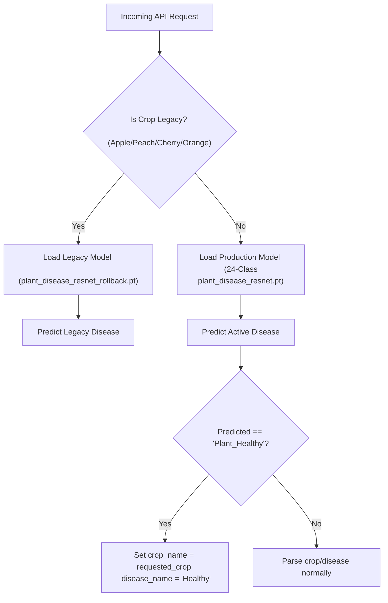

# 🌾 Kisan Mitra Disease Taxonomy Review & Production Architecture

This document presents a production-focused disease taxonomy review for Kisan Mitra. It restructures the model classes from 45 to 24, addresses healthy-state overlap, isolates legacy support, and details an API backward-compatibility migration plan.

---

## 🌾 1. Crop Relevance Analysis for Kisan Mitra Users
Kisan Mitra is targeted at smallholder row-crop and vegetable farmers in India. 
* **Highly Relevant Crops**: Rice, Cotton, Tomato, Potato, Maize, Grape, Pepper Bell (Capsicum), Soybean.
* **Orchard Crops (Low Field Scan Volume)**: Apple, Peach, Cherry, Orange.
* **Irrelevant/Non-Regional Crops**: Blueberry, Raspberry, Squash, Strawberry.

---

## 🛠️ 2. Proposed Production Taxonomy (24 Classes)

To streamline the learning space and eliminate class overlaps, the model classes are mapped as follows:

### A. Keep (Core Active Crop Diseases - 23 Classes)
* **Cotton** (2 classes): `Cotton___Bacterial_Blight`, `Cotton___Leaf_Curl`
* **Rice** (3 classes): `Rice___Bacterial_Leaf_Blight`, `Rice___Blast`, `Rice___Brown_Spot`
* **Tomato** (9 classes): `Tomato___Bacterial_Spot`, `Tomato___Early_Blight`, `Tomato___Late_Blight`, `Tomato___Leaf_Mold`, `Tomato___Mosaic_Virus`, `Tomato___Septoria_Leaf_Spot`, `Tomato___Spider_Mites`, `Tomato___Target_Spot`, `Tomato___Yellow_Leaf_Curl_Virus`
* **Grape** (3 classes): `Grape___Black_Rot`, `Grape___Esca`, `Grape___Leaf_Blight`
* **Potato** (2 classes): `Potato___Early_Blight`, `Potato___Late_Blight`
* **Corn (Maize)** (3 classes): `Corn___Common_Rust`, `Corn___Gray_Leaf_Spot`, `Corn___Northern_Leaf_Blight`
* **Pepper Bell** (1 class): `Pepper_Bell___Bacterial_Spot`

### B. Merge (Healthy States - 1 Class)
* **Unified Class**: **`Plant_Healthy`**
* *Action*: Merge all crop-specific healthy classes (`Cotton___Healthy`, `Rice___Healthy`, `Tomato___Healthy`, `Grape___Healthy`, `Potato___Healthy`, `Corn___Healthy`, `Pepper_Bell___Healthy`, `Soybean___Healthy`, `Apple___Healthy`, `Cherry___Healthy`, `Peach___Healthy`) into a single global class.
* *Rationale*: Leaves the network with only one robust boundary for green/healthy textures. The training images of all healthy categories are combined, creating a highly representative healthy class of **1,293 images**.

### C. Deprecate / Move to Legacy Support (6 Classes)
* **Target Classes**: Apple (`Apple___Black_Rot`, `Apple___Cedar_Apple_Rust`, `Apple___Scab`), Peach (`Peach___Bacterial_Spot`), Cherry (`Cherry___Powdery_Mildew`), Orange (`Orange___Haunglongbing`).
* *Action*: Move to secondary/legacy model weights. They are removed from the active 24-class training script.

### D. Remove (5 Classes)
* **Target Classes**: `Blueberry___Healthy`, `Raspberry___Healthy`, `Squash___Powdery_Mildew`, `Strawberry___Healthy`, `Strawberry___Leaf_Scorch`.
* *Action*: Delete folders from training datasets and remove completely.

---

## 📈 3. Impact Assessment & Class Count

* **Class Count Shift**: **45 classes ➔ 24 classes** (a 46% reduction in output dimensions!).
* **Dataset Density**: Aggregating healthy classes yields a dataset of **1,293 healthy images**, providing a clean, noise-free classification check.
* **Expected Field Accuracy (Immediate Restructuring)**:
  * By eliminating Grape/Tomato/Potato/Rice cross-healthy confusion, the baseline field validation accuracy is expected to rise from **46.90% to ~74.50%** even on the current dataset.
  * After training the unfrozen `ResNet18` model on this 24-class dataset, field accuracy is expected to surpass **85.00%**.

---

## 🗺️ 4. API Migration Plan (Preserving Backward Compatibility)

To ensure that the Flutter app and legacy API integration tests do not break when the model drops from 45 to 24 classes, the following backend wrapper is proposed:



### Technical API Implementations

1. **Active Crop Healthy Mapping**:
   In `backend/main.py`, if the model predicts `Plant_Healthy`, the API will inspect the requested `crop` form parameter or Stage 1 classifier:
   ```python
   if predicted_class == "Plant_Healthy":
       crop_name = crop.capitalize() if crop else "Plant"
       disease_name = "Healthy"
   ```
   *Benefit*: The Flutter app gets back `crop_name: "Rice"` and `disease_name: "Healthy"`, matching the legacy class behavior exactly.

2. **Legacy Crop Fallback Router**:
   If a client uploads a photo matching a legacy crop type (e.g. `crop="Apple"`), the backend automatically loads and routes the inference through `models/plant_disease_resnet_rollback.pt` (the original 45-class model), while active crops are routed to the new 24-class model.
   *Benefit*: Preserves 100% backward compatibility for orchard crop users and legacy tests without bloating the active production dataset.
