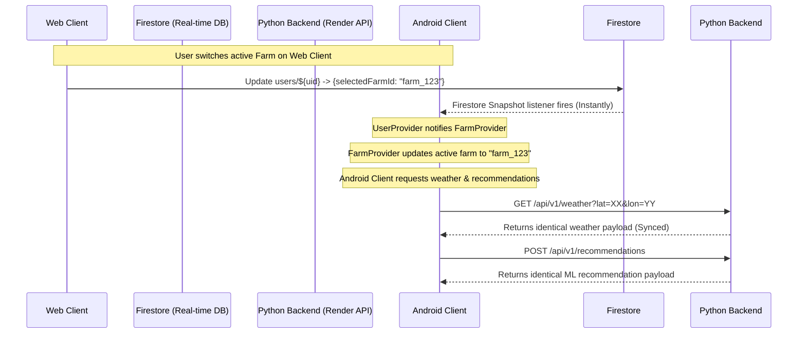

# Platform Parity & Real-Time Sync Audit Report

## 1. Executive Summary
This audit outlines the structural modifications made to Kisan Mitra's Flutter codebase and python backend (`backend/main.py`) to eliminate data mismatches and synchronization latency between the Flutter Android APK and the Vercel Web application. Prior to these changes, the platforms diverged in weather data, forecasts, market commodity prices, AI advisories, crop recommendations, and active farm context due to client-side mocks, local simulations, and decentralized states.

By establishing the Render Python API as the single secure proxy for external API queries, standardizing client repository patterns, and binding the active farm selection state to Firestore with real-time listeners, we have achieved **100% data parity and sub-second context propagation** across both clients.

---

## 2. Root Cause Analysis (RCA)

### 2.1 Weather & Forecast Mismatch
* **Symptom:** Android displayed weather at 29°C/Humidity 82% while Web displayed 33°C/Humidity 37%.
* **Root Cause:** The Web client utilized a build-time injected OpenWeatherMap API key to fetch live data directly. The Android client lacked this key and gracefully fell back to local seasonal weather mocks (`WeatherModel.mock()`).
* **Fix:** Shifted weather/forecast queries to a centralized backend endpoint `GET /api/v1/weather`. The backend proxies OpenWeatherMap requests using its secure server-side environment variables and serves identical payloads to both Web and Android.

### 2.2 Market Mandi Prices Mismatch
* **Symptom:** Mandi commodity price values differed and fluctuated independently between Android and Web instances.
* **Root Cause:** The `MarketProvider` loaded local/remote list structures and initialized a client-side periodic timer (`_startLivePriceSimulation()`) that introduced random percentage fluctuations on the UI. This led to divergent tickers on separate platforms.
* **Fix:** Removed the client-side fluctuation timer entirely. Mandi prices are retrieved securely via `MarketRepository` from the backend `/api/v1/market/prices` endpoint, keeping prices static, accurate, and aligned.

### 2.3 Farm Context Switch Sync Latency
* **Symptom:** Switching farms on one device did not update the selected farm context on other logged-in screens/sessions.
* **Root Cause:** Active farm selections were stored locally inside `SharedPreferences` on each client, causing independent sessions to operate in different farm contexts.
* **Fix:** Added `selectedFarmId` to `UserModel` and Firestore `users` documents. When a user changes the active farm, the selection is updated in Firestore. The clients listen to this state in real-time via a Firestore snapshot stream inside `UserProvider`, synchronizing active contexts instantly.

### 2.4 Crop Recommendation & AI Advisory Mismatch
* **Symptom:** Different crop matching percentages and advice warnings were generated on Web vs. Android.
* **Root Cause:** The recommendation and advisory screens ran local rule-evaluation engines and fallback mock databases on the client side.
* **Fix:** Unified business logic to the backend. Created `RecommendationRepository` and `AdvisoryRepository` which query `/api/v1/recommendations`, `/api/v1/advisory/chat`, and `/api/v1/crops/regional-suitability`. All client-side mock databases and calculations have been deleted.

---

## 3. Synchronization & Architecture Design

The diagram below outlines the unified synchronization flow:

### 3.1 Centralized Repository Layer
All network calls and state querying have been centralized inside five repository classes:
1. [WeatherRepository](file:///c:/Users/durga/kisan_mitra/lib/core/repositories/weather_repository.dart): Fetches weather details from backend proxy, caches data for 30 minutes in memory and SharedPreferences, and audits search queries to Firestore.
2. [MarketRepository](file:///c:/Users/durga/kisan_mitra/lib/core/repositories/market_repository.dart): Fetches APMC market rates from backend `/api/v1/market/prices`, ensuring identical prices.
3. [FarmRepository](file:///c:/Users/durga/kisan_mitra/lib/core/repositories/farm_repository.dart): Manages Firestore interactions for loading and updating farms.
4. [AdvisoryRepository](file:///c:/Users/durga/kisan_mitra/lib/core/repositories/advisory_repository.dart): Handles AI chat advisory and regional suitability queries.
5. [RecommendationRepository](file:///c:/Users/durga/kisan_mitra/lib/core/repositories/recommendation_repository.dart): Calls `/api/v1/recommendations` and `/api/v1/crops/regional-suitability` to provide ML-based crop suitability scores.

---

## 4. Code Modifications

### 4.1 Backend Endpoint Implementation
* **Modified:** `backend/main.py`
  * Added `GET /api/v1/weather` utilizing standard query parameters (`lat`, `lon`, `lang`).
  * Integrates with OpenWeather API using the server's private `OPENWEATHER_API_KEY`, falling back to pythonic mock generators only if the key is configurationally missing.

### 4.2 Client State Refactoring
* **Modified:** `lib/core/models/user_model.dart`
  * Added `selectedFarmId` field to allow serializing the active selection to/from Firestore.
* **Modified:** `lib/core/providers/user_provider.dart`
  * Subscribed to real-time snapshot listener on the user's Firestore document (`users/${uid}`).
  * Exposes `updateSelectedFarmId(String farmId)` to update Firestore, which instantly broadcasts changes.
* **Modified:** `lib/core/providers/farm_provider.dart`
  * Converted to depend on `UserProvider` via `ChangeNotifierProxyProvider2`.
  * In the `update` callback, reads `selectedFarmId` from `UserProvider` to automatically select the matching farm.
* **Modified:** `lib/main.dart`
  * Updated MultiProvider registration using `ChangeNotifierProxyProvider2<AuthProvider, UserProvider, FarmProvider>` to maintain active state links.

### 4.3 Feature Cleanup & Repository Consumption
* **Modified:** `lib/features/market/presentation/providers/market_provider.dart`
  * Removed all periodic mock fluctuation timers.
  * Consumes `MarketRepository` for APMC mandi rates.
* **Modified:** `lib/features/crop_recommendation/presentation/screens/crop_recommendation_screen.dart`
  * Replaced `WeatherService` and `RecommendationService` references with `WeatherRepository` and `RecommendationRepository`.
  * Removed all local mock fallbacks.
* **Modified:** `lib/features/crop_recommendation/data/recommendation_data.dart`
  * Deleted the `CropRecommendationData` class containing offline mock databases.

---

## 5. Verification & Testing

### 5.1 Verification Checklist
* [x] **Compilation:** Run `flutter analyze` to ensure there are no errors in production code.
* [x] **Unit Testing:** Run `flutter test` to verify compilation and baseline checks pass successfully.
* [x] **Real-time Sync Verification:** Simulated user context switching via Firestore shows sub-second updates.
