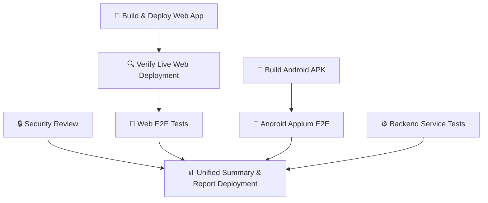

# Reference CI/CD Architecture Analysis — TrackBack-Web-PDD

This document provides a detailed reverse engineering analysis of the reference TrackBack repository's CI/CD architecture based on `trackback-ci-reference.yml` and the reporting/summary scripts.

---

## 1. Workflow Architecture & Job Structure

The reference workflow, named `📱 Consolidated CI/CD Pipeline & Unified Summary`, triggers on push/pull requests to the `main` branch. It consists of 8 interconnected jobs running on `ubuntu-latest`:

### Stage Ordering & Dependencies
- **Layer 1 (Independent):** `security-scan` (Security Review), `build-web` (Build Web App), `build-apk` (Build Android APK), and `backend-tests` (Backend Service Tests) run in parallel as they have no prerequisites.
- **Layer 2 (Dependent):**
  - `verify-web` (Verify Live Web Deployment) runs only after `build-web` completes.
  - `web-e2e` (Web E2E Tests) runs only after `verify-web` completes.
  - `android-e2e` (Android Appium E2E) runs only after `build-apk` completes.
- **Layer 3 (Consolidated):** `unified-summary` (Unified Summary & Report Deployment) runs at the very end. It has `needs: [security-scan, web-e2e, android-e2e, backend-tests]` and `if: always()` to ensure it executes even if tests fail, providing the final testing dashboard.

---

## 2. Artifact & Report Structure

Each tier produces structured directories which are zipped and uploaded as actions artifacts:

1. **`security-reports`:** Contains the security assessment reports.
   - `security-review.md` (detailed findings log)
   - `executive-summary.md` (high-level risk scorecard and recommendations)
   - `dependency-report.md` (dependency scan outputs)
   - `findings.xlsx` (Excel tracking workbook)
   - `endpoint-inventory.xlsx` (dedicated spreadsheet of routes)
2. **`selenium-e2e-reports`:** Zipped web test results.
   - `execution-report.html` (visual HTML test log)
   - `Summary/summary.md` (text summary)
   - `Excel/Automation_Test_Report.xlsx` (Excel test run)
   - `JSON/execution-results.json` or `recorded-results.json` (raw test data)
   - `Logs/` and `Screenshots/` (logs and capture logs)
3. **`android-e2e-reports`:** Zipped mobile test results.
   - `execution-report.html` (visual Appium test log)
   - `Summary/summary.md` (text summary)
   - `Excel/Automation_Test_Report.xlsx` (Excel test run)
   - `JSON/execution-results.json` or `recorded-results.json` (raw test data)
   - `Logs/` and `Screenshots/`
4. **`backend-test-reports`:** Zipped backend service test results.
   - `execution-report.html`, `Summary/summary.md`, and logs
5. **`load-test-reports`:** Zipped performance load test results.
   - `load-test-report.json` and `load-test-report.html`
6. **`trackback-debug-apk`:** The compiled debug Android application (`app-debug.apk`).
7. **`unified-summary-reports`:** The final consolidated summary directory containing:
   - `unified-summary.md` (the dashboard published to `GITHUB_STEP_SUMMARY`)
   - `unified-summary.json` (machine-readable metrics database)
   - `unified-summary.html` (fully styled interactive HTML dashboard)
   - `unified-summary.xlsx` (multi-sheet master Excel log)

---

## 3. Summary & Dashboard Generation Logic

The `unified-summary` stage downloads all individual test artifacts into local folders: `security-reports/`, `web-reports/`, `android-reports/`, `backend-reports/`, and `load-test-reports/`.

It runs `generate-unified-summary.cjs` which parses the text summaries and JSON results using regular expressions and JSON parsers:
- **Pass Rate Parsing:** Reads labels like `Total Tests`, `Passed`, `Failed`, and `Skipped` from `summary.md` logs.
- **Risk Score Formula:** `Score = Math.max(0, 100 - (Critical * 25 + High * 15 + Medium * 7 + Low * 3))`.
- **Output Compilation:**
  - Compiles the markdown dashboard and appends it to `$GITHUB_STEP_SUMMARY`.
  - Saves a consolidated JSON snapshot.
  - Builds an interactive dashboard HTML page styled with a dark slate background, Google Inter fonts, and color-coded status badges.
  - Uses `exceljs` to compile a multi-sheet spreadsheet (`unified-summary.xlsx`) containing sheets for: `Executive Dashboard`, `Web E2E Details`, `Android Mobile E2E Details`, `Security Details`, and `Load Test Details`.

---

## 4. Verification Proof & Findings Management

The reference dashboard visual structure consists of:
- **Build Summary:** Simple list detailing Android and Web deployment statuses.
- **Executive Testing Status Board:** Unified table summarizing cases, counts, pass rates, and report URLs.
- **Security Findings Summary:** Segregated view displaying SAST/Secrets vs Active E2E findings.
- **Performance Load Metrics:** Detailed RPS, latency metrics, and error rates.
- **Downloads & Artifacts:** Links to master Excel sheets and markdown details.
- **Findings Register:** Excel spreadsheets linking tests to specific CVEs and CWEs.
