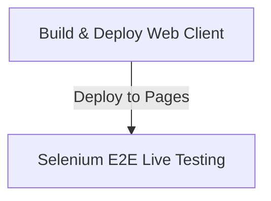

# CI/CD Execution Guide — Web Selenium E2E

This guide details the automated pipeline setup in GitHub Actions that manages web compilation, deployment to Pages, verification checks, and Selenium execution.

## Pipeline Architecture & Stages
The pipeline is defined in `.github/workflows/deploy-and-test.yml` and executes two main sequential jobs:

### Stage Details
1. **Build & Deploy Web Client**: Installs Java 17 and Flutter SDK, compiles a web release build targeting the repository path subfolder, and deploys it to the `gh-pages` branch.
2. **Selenium E2E Live Testing**:
   - Downloads the repo and sets up Python.
   - Wait for Deployment: Performs a polling check querying the live Pages URL for up to 5 minutes to verify it returns HTTP 200 and loads successfully.
   - Run Selenium Tests: Launches Chrome in Headless mode inside the GHA runner and runs `run_tests.py` using `pytest`.
   - Publish Summary: Displays execution details, passing/failing module tables directly on the GitHub Actions summary page.

## Triggers
- **Push**: Automatically triggers on pushes to the `main` or `master` branches.
- **Pull Request**: Triggers on pull requests targeting `main` or `master`.
- **Workflow Dispatch**: Can be triggered manually from the GitHub Actions dashboard.
