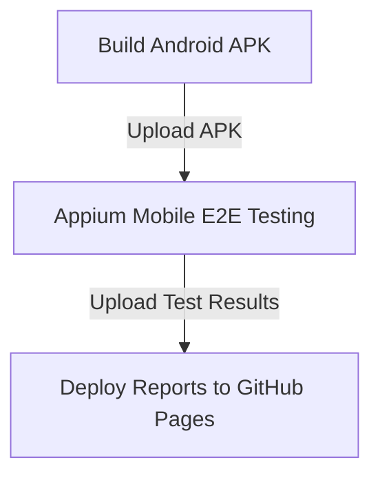

# CI/CD Execution Guide — Android Appium E2E

This guide details the automated pipeline setup in GitHub Actions that manages APK compilation, emulator boot, Appium execution, and test reporting.

## Pipeline Architecture & Orchestration
The pipeline is defined in `.github/workflows/android-e2e.yml` and executes three sequential jobs:

### Stage Details
1. **Build Android APK**: Installs Java 17 and Flutter SDK, fetches pub dependencies, compiles a debug APK, and uploads it.
2. **Appium Mobile E2E Testing**:
   - Launches a headless Android Emulator (x86_64, API level 29) on an Ubuntu runner using KVM hardware acceleration.
   - Spins up Appium Server with UiAutomator2 driver.
   - Automatically installs the APK and runs `run_mobile_tests.py` using `pytest`.
3. **Deploy Reports to GitHub Pages**: Checks out the `gh-pages` orphan branch, copies generated HTML, XML, Excel, and screenshot artifacts, publishes them online, and posts a rich Markdown report to the GitHub Actions Job Summary.

## Triggers
- **Push**: Automatically triggers on pushes to the `main` or `master` branches.
- **Pull Request**: Triggers on pull requests targeting `main` or `master`.
- **Workflow Dispatch**: Can be triggered manually from the GitHub Actions dashboard.
